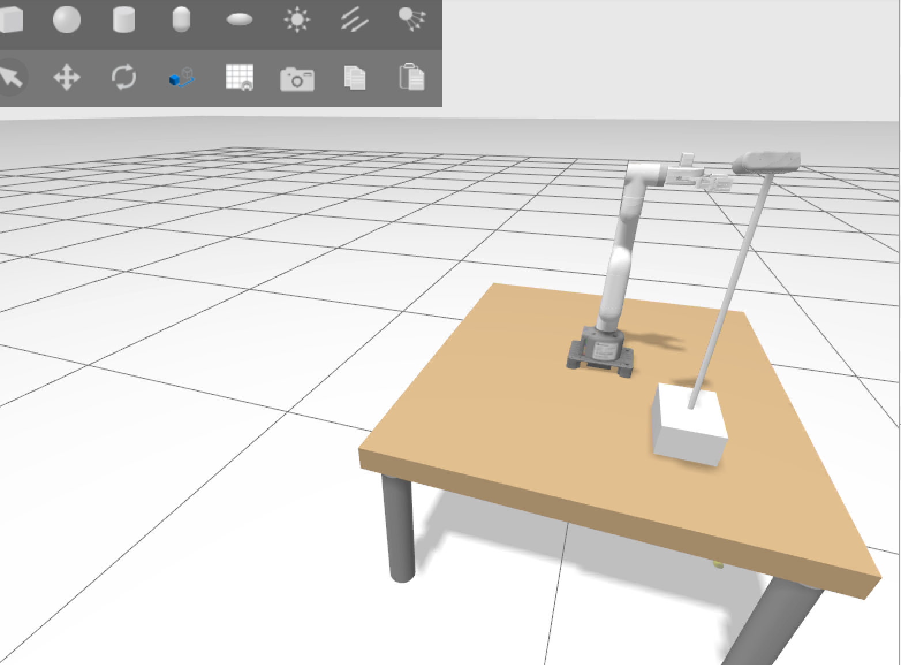
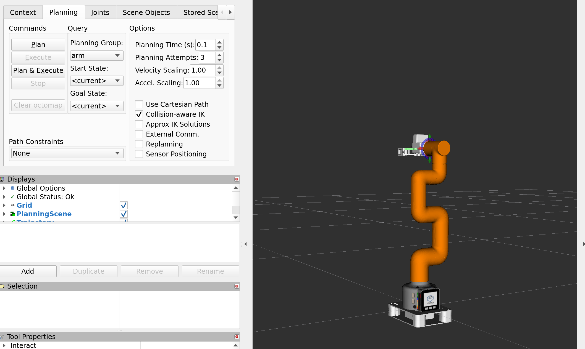
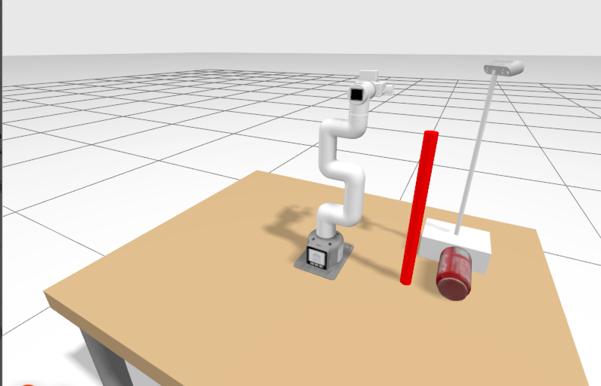

# myCobot 280 — ROS 2 Humble Control Stack

A complete ROS 2 Humble stack for the Elephant Robotics myCobot 280 M5 with an
adaptive gripper. The same robot description, MoveIt 2 configuration and
controller set drive either an Ignition Gazebo Fortress simulation or the
physical arm over USB serial — the two are swapped at the `ros2_control`
plugin boundary, not by maintaining two parallel stacks.



Four ROS 2 packages in two folders:

| Directory | Contents |
|---|---|
| [`mycobot_sim_interface/`](mycobot_sim_interface) | Three packages: robot description, Gazebo simulation, and MoveIt 2 configuration. |
| [`mycobot_hardware_interface/`](mycobot_hardware_interface) | C++ `ros2_control` `SystemInterface` plugin. Speaks the myCobot binary serial protocol to the real arm. |

---

## Packages

| Package | Role |
|---|---|
| `mycobot_description` | URDF/xacro, meshes, `ros2_control` block, adaptive gripper, optional RealSense D435 |
| `mycobot_gazebo` | Fortress worlds, models, ROS–Ignition bridges, and `mycobot_combined.launch.py` — the single entry point that brings up everything |
| `mycobot_moveit_config` | SRDF, kinematics, joint limits, the OMPL/Pilz/STOMP planning pipelines, and the sim/hardware controller YAMLs |
| `mycobot_hardware_interface` | Serial protocol layer + `SystemInterface` plugin for the physical arm |

Planning groups: `arm` (6 joints), `gripper`, and `arm_with_gripper`.
Named states: `home`, `ready`, `open`, `half_closed`, `closed`.

---

## Requirements

Ubuntu 22.04 with ROS 2 **Humble** and Ignition **Gazebo Fortress**.

```bash
sudo apt install -y \
    ros-humble-moveit \
    ros-humble-ros2-control \
    ros-humble-ros2-controllers \
    ros-humble-ros-ign-gazebo \
    ros-humble-ros-ign-bridge \
    ros-humble-ros-ign-image \
    ros-humble-ign-ros2-control \
    ros-humble-joint-state-publisher-gui \
    ros-humble-robot-state-publisher \
    ros-humble-xacro \
    ros-humble-moveit-configs-utils \
    ros-humble-moveit-planners-ompl \
    ros-humble-moveit-simple-controller-manager \
    ros-humble-pilz-industrial-motion-planner \
    ros-humble-gripper-controllers
```

Building `mycobot_hardware_interface` additionally needs libserial, which is
not a ROS package:

```bash
sudo apt install -y libserial-dev
```

## Build

Clone into the `src/` of a colcon workspace:

```bash
mkdir -p ~/ros2_ws/src && cd ~/ros2_ws/src
git clone <repo-url>

cd ~/ros2_ws
rosdep install --from-paths src --ignore-src -r -y
colcon build --symlink-install
source install/setup.bash
```

colcon walks the tree for `package.xml` files, so the two folders need no
special handling — all four packages are found and built.

### Simulation only

Nothing needs the hardware plugin unless `use_sim:=false`. To skip building it
(and its `libserial-dev` dependency):

```bash
colcon build --symlink-install \
    --packages-select mycobot_description mycobot_gazebo mycobot_moveit_config
```

The link between the two halves is a single runtime pluginlib lookup, not a
`package.xml` dependency: the `ros2_control` xacro names the plugin by the
string `mycobot_hardware_interface/MyCobotSystemInterface`, and resolves it
only on the hardware path. With `use_sim:=true` the stack loads
`ign_ros2_control/IgnitionSystem` instead and never looks for it.

---

## Running

### Simulation

```bash
ros2 launch mycobot_gazebo mycobot_combined.launch.py
```

Brings up Gazebo, the controllers, MoveIt 2 and RViz in one command. Plan and
execute from the **MotionPlanning** panel — set a goal state, then *Plan &
Execute*, and the arm moves in Gazebo.

Turn **Velocity Scaling** down below `0.5` before executing to decelerate motion
speed and avoid collisions. Both scaling boxes default to `1.0` (from
`default_velocity_scaling_factor` in `joint_limits.yaml`), and at full scale the
planner may command up to `2.79` rad/s per joint.



| Argument | Default | Purpose |
|---|---|---|
| `use_sim` | `true` | `false` drives the physical arm instead |
| `use_rviz` | `true` | RViz with the MoveIt MotionPlanning panel |
| `use_gz_gui` | `true` | `false` runs the Gazebo server headless (`-s`) |
| `use_gripper` | `true` | Fit and drive the adaptive gripper |
| `use_camera` | `false` | RealSense D435 on the fixed stand |
| `robot_name` | `mycobot_280` | Selects the description and MoveIt config |
| `world_file` | `empty.world` | `calibration.world` adds a table whose top surface is at `0.425`; spawn `z` auto-raises to `0.46` |
| `x y z roll pitch yaw` | `0 0 0.05 0 0 0` | Spawn pose |

#### Tabletop world with the camera

```bash
ros2 launch mycobot_gazebo mycobot_combined.launch.py use_camera:=true world_file:=calibration.world
```

Spawns the arm on the table with the RealSense D435 on its stand, looking
across the workspace. The camera sits at `base_link` + (0.167, 0.242, 0.433),
panned 162.13° and tilted 23.97° below horizontal — the pose measured on the
physical rig, shared with the hand-eye calibration repository. Stand position,
camera offset, pan and tilt are all launch arguments (`camera_stand_x/y/z`,
`camera_offset_x/y/z`, `camera_pan_deg`, `camera_tilt_deg`).

The spawn `z` auto-raises to `0.46`. `base_link` is not the bottom of the
chassis: the base mesh is millimetre-scaled, spans ±0.055 m, and its visual
origin adds another −0.03, so the chassis bottom sits **0.085 m below**
`base_link`. The table slab is 0.05 m thick centred at `z = 0.4`, giving a top
surface at `0.425`, so seating the chassis exactly on it would need `z = 0.510`.

`0.46` is used instead, matching the calibration repository. It leaves the
chassis flush with the underside of the slab — presentation only, since the
calibration only ever sees `base_link → camera`. **`camera_stand_drop` in the
camera xacro must equal `z − 0.425`**; it is `0.035` to match `0.46`. Changing
one without the other leaves the camera stand floating or sunk.

Bridged topics:

| Topic | |
|---|---|
| `/camera_head/color/image_raw` | RGB |
| `/camera_head/depth/image_rect_raw` | depth |
| `/camera_head/color/camera_info`, `/camera_head/depth/camera_info` | intrinsics |
| `/camera_head/depth/color/points` | coloured point cloud |

View a stream with `rqt_image_view`, **not** an RViz Image display:

```bash
ros2 run rqt_image_view rqt_image_view /camera_head/color/image_raw
```

Adding an `rviz_default_plugins/Image` display to `move_group.rviz` segfaults
RViz (exit −11) and the launch teardown takes Gazebo, `move_group` and the
controller spawners down with it — so the whole simulation dies, with GL errors
in the log that send you hunting the wrong thing. An Image display is fine on
its own; it is the combination with MoveIt's **MotionPlanning** display that
crashes, and this config carries one.

#### Spawning objects

Six models ship in `mycobot_gazebo/models/`: `coke_can`, `cardboard_box`,
`cheezit_big_original`, `mustard`, `red_cylinder`, `brown_table`. With the
simulation running, spawn one from a second terminal:

```bash
ros2 run ros_ign_gazebo create -file red_cylinder -name cyl -x 0.20 -y 0.0 -z 0.60
```

```bash
ros2 run ros_ign_gazebo create -file coke_can -name my_can -x 0.20 -y 0.10 -z 0.50
```

The bare model name resolves because the launch file puts the models directory
on `IGN_GAZEBO_RESOURCE_PATH`; a full path to its `model.sdf` works too.

**Where the object actually lands depends on the model.** The `-z` you pass
positions the model *origin*, and the origin is not in the same place in every
model:

| Model | Origin | Placing it on the table (surface `0.425`) |
|---|---|---|
| `red_cylinder` | at its centre, no internal offset | `-z 0.60` — it is 0.35 m long, so `0.425 + 0.175` |
| `coke_can` | 0.12 m above the geometry (link pose `+0.06`, mesh pose `−0.18`) | drop from `-z 0.50`; it settles with the origin ≈ 0.017 m below the surface |

For anything with an internal offset, spawn *above* the surface and let it fall
rather than trying to place it exactly.

Remove a model again — note the world name in the path differs per world
(`calibration.world` is `calibration_world`, `empty.world` is `default`):

```bash
ign service -s /world/calibration_world/remove --reqtype ignition.msgs.Entity --reptype ignition.msgs.Boolean --timeout 2000 --req 'name: "cyl", type: MODEL'
```



Two things to know before using these for manipulation. `red_cylinder` is
0.35 m tall and 0.03 m across at 50 g — it stands if spawned perfectly upright
into a still scene, but that aspect ratio topples easily, and its collision
radius (0.015) is larger than its visual radius (0.0125), so the gripper makes
contact before it looks like it should.

And objects spawned this way exist only in Gazebo. They are **not** added to
MoveIt's planning scene, so `move_group` will plan straight through them.

#### Headless operation

`ign gazebo` starts the GUI and the server as a single process, so when the GUI
cannot obtain a working GL context it terminates and takes the server with it —
leaving the ROS bridges running and the simulation silently dead, with no error
on any ROS topic. 

`use_gz_gui:=false` passes `-s` to run the server alone. Camera sensors keep
rendering either way: the Sensors system uses its own render context and does
not depend on the GUI. Anything camera-driven and unattended should run this
way.

### Physical robot

```bash
ros2 launch mycobot_gazebo mycobot_combined.launch.py use_sim:=false
```

Before the first run, confirm the arm enumerates and the user can reach it:

```bash
ls -l /dev/ttyACM0 && groups | grep -q dialout || sudo usermod -aG dialout $USER
```

The port and baud rate are `<param>` tags in the `ros2_control` xacro
(`/dev/ttyACM0`, `115200` by default) — edit them there, not in the C++.

If the arm does not respond, `test_serial_live` talks to it directly through
the same `MyCobotSerial` class the plugin uses, which isolates a wiring or
firmware problem from a ros2_control one:

```bash
colcon build --packages-select mycobot_hardware_interface --cmake-args -DBUILD_TESTING=ON
./build/mycobot_hardware_interface/test_serial_live
```

---

## The hardware interface

`MyCobotSystemInterface` exports position command and state interfaces for the
six arm joints plus the gripper. Underneath, `MyCobotSerial` implements the
myCobot binary framing with no ROS dependency, so the protocol is unit-testable
on its own (`colcon test`, or `test_serial_live` against a connected arm):

```
[0xFE][0xFE][LEN][CMD_ID][DATA...][0xFA]      angles = degrees × 100, int16 big-endian
```

Three timing constants carry the hard-won behaviour, and each is documented in
[`mycobot_system_interface.hpp`](mycobot_hardware_interface/include/mycobot_hardware_interface/mycobot_system_interface.hpp)
with the measurements behind it:

- **10 Hz control rate on hardware** (100 Hz in sim). `GET_ANGLES` latency is
  bimodal while the firmware drives servos — ~14 ms typical with a tail at
  58–60 ms — and each cycle must fit both a read and a write.
- **80 ms query timeout.** Clears the observed 59.6 ms worst case with headroom;
  a tighter deadline turned slow-but-healthy replies into read failures.
- **250 ms minimum write interval.** The firmware runs its own point-to-point
  interpolation to the last target it received, so commanding it every cycle
  restarts the move before it completes and floods the ESP32 receive buffer.
  Pacing to ~4 Hz lets point-to-point moves land reliably.

Ten consecutive read failures escalate to `ERROR`, which releases the servos and
closes the port via the `on_error` lifecycle hook.

### Gripper

One actuated joint, `gripper_controller`, with five mimic joints in the URDF for
the linkage. The interface maps the joint range (`0.0` rad open → `-0.5` rad
closed) onto the firmware's `0`–`100` scale via `SET_GRIPPER_VALUE` (`0x67`).
It runs open-loop — state mirrors command — because the adaptive gripper's
reported feedback spans only 17–96 and never reaches the commanded endpoints,
which is why the hardware controller YAML uses a generous `goal_tolerance`.

